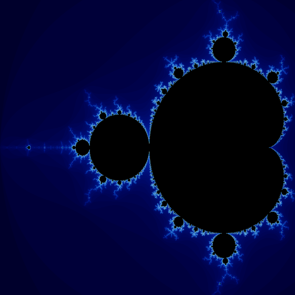
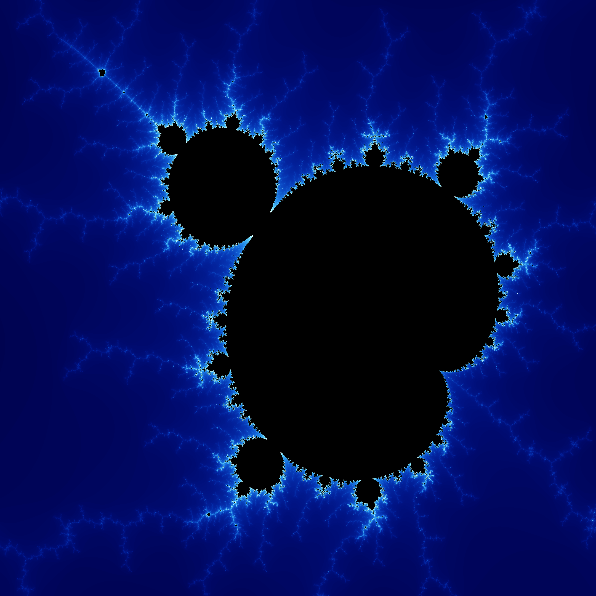
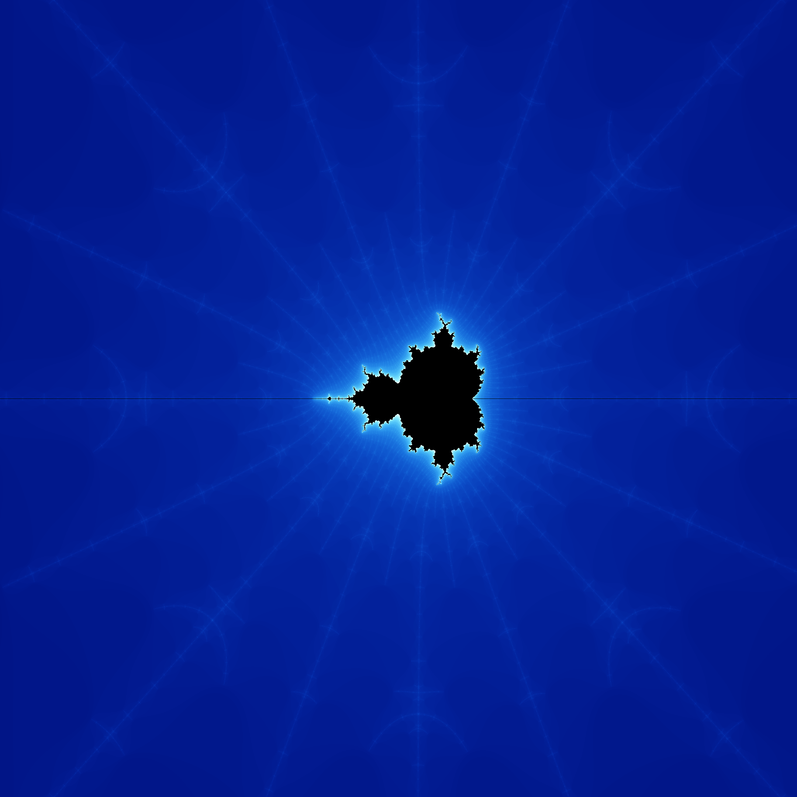

# Mandelbrot CLI

_A Rust-powered Mandelbrot Set generator._

## Installation

Install Mandelbrot CLI with cargo:

```bash
$ cargo install mandelbrot_cli
```

## Usage

Generate the Mandelbrot Set with default settings:

```bash
$ mandelbrot_cli
```

Open the output file "out.png" and it will look like this:



Explore the Mandelbrot Set and refine your images using the available options:

```
  -s, --size <SIZE>                    [default: 2160]
  -x, --x-offset <X_OFFSET>            [default: 0]
  -y, --y-offset <Y_OFFSET>            [default: 0]
  -m, --magnification <MAGNIFICATION>  [default: 1]
  -i, --iterations <ITERATIONS>        [default: 100]
  -o, --output-path <OUTPUT_PATH>      [default: out.png]
  -h, --help                           Print help
```

**Negative numbers**: You can pass negative numbers to the -x and -y arguments like this:

```
$ mandelbrot_cli -x=-1.0 -y=-0.23
```

## Usage as a Crate

The functions to rendering the Mandelbrot Set are public so you can import them into your own Rust projects.  See [Crate documentation](https://crates.io/crates/mandelbrot_cli) for details.

# Gallery

```
$ mandelbrot_cli -m 4.55 -x 0.64 -y 0.89 
```


```
$ mandelbrot_cli -m 110 -x 0.605 -y 1.0335 -i 200 
```



```
$ mandelbrot_cli -m 4000000 -x=-1.0999975 -i 250
```

